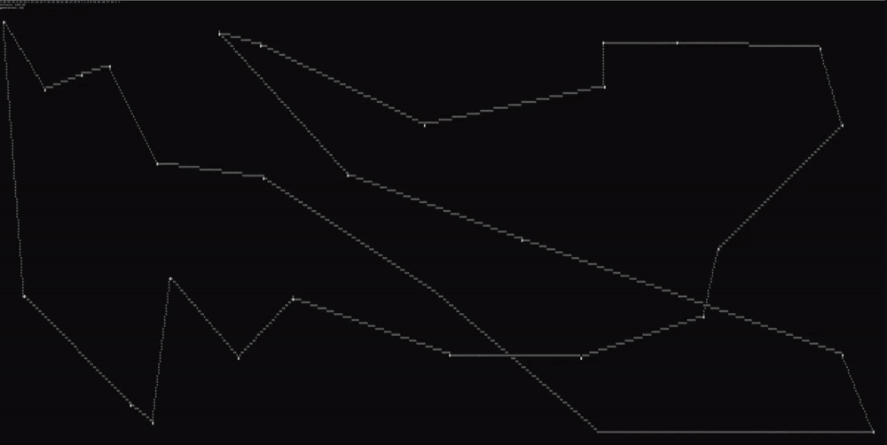

# Genetic TSP

  
  

# Description
TSP optimized with a genetic algorithm using OX1 crossbreeding, written in C++. Visualization done in terminal window. For now arbitrary node locations are generated on each run, but I'll implement adding nodes manually with the mouse soon enough.

### How does this work?
| Process            | Implementation                                                                                                         |
| -------------------|:----------------------------------------------------------------------------------------------------------------------:|
| Initial population | Accomplished by creating N permutations of a size K vector.                                                            |
| Crossbreeding      | [OX1](https://www.rubicite.com/Tutorials/GeneticAlgorithms/CrossoverOperators/Order1CrossoverOperator.aspx) method.    |
| Selection          | Elitist selection (fitness criteria: routes with lowest distance).                                                     |
| Mutation           | Probability-based vector swap.                                                                                         |

### Challenges
The hardest part about this was implementing the OX1 crossbreeding method. Since TSP relies heavily on order and some structure is necessary (i.e. first and last position must be the same, elements in the middle must be unique, etc.), normal crossbreeding simply cannot be used. I think my implementation of it turned out decently, however it could still be heavily improved I'm sure.
